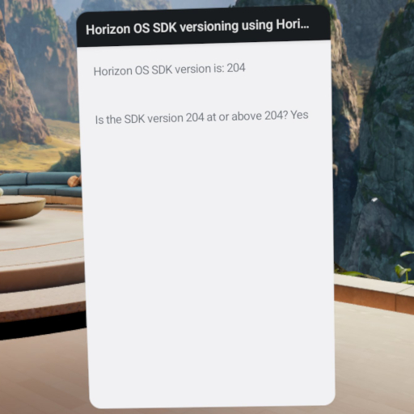

<!--
  Copyright (c) Meta Platforms, Inc. and affiliates.

  This source code is licensed under the MIT license found in the
  LICENSE file in the root directory of this source tree.
-->

# Meta VR OS SDK versioning using Meta VR OS JSDK and Utility Library

This sample demonstrates a simple Android Studio project using APIs from the Meta VR OS SDK to query the Meta VR OS SDK version available on a Quest device. Specifically, APIs from both the [Meta VR OS Java Software Development Kit (JSDK)](https://developers.meta.com/horizon/documentation/android-apps/metavr-os-jsdk) and Utility Library are shown.

This sample uses Kotlin, but the same APIs are easily accessed via Java.

See the [Meta VR OS SDK versioning documentation](https://developers.meta.com/horizon/documentation/android-apps/metavr-os-sdk-versioning/) for more information.

## Sample project setup

This project can be imported directly into Android Studio. After launching Android Studio, select **File -> New -> Import Project**, select this project's root directory (`VersioningSample`), and click **Open**.

## Running the sample

After building the sample and installing it onto a Quest device, launch it. It will look like the following screenshot:

### Querying the Meta VR OS SDK version

When you run the sample, you will see a `TextView` displaying a string containing the version of Meta VR OS SDK available on the device, such as `207`. This value is fetched from `Build.Version.getApiVersion()`, which is available via `import metavr.os.Build`.

In your app, you can use the version returned by `metavr.os.Build.Version.getApiVersion()` to make a single build of your app compatible with multiple versions of the Meta VR OS SDK simultaneously.

### Comparing the Meta VR OS SDK version to a specific version

You will also see a `TextView` comparing the version of the Meta VR OS SDK available on the device to the version specified in `SDK_VERSION_TO_COMPARE_WITH_ISATORABOVE` within `app/src/main/java/metavr/os/sdk/sample/versioning/MainActivity.kt`. The comparison is executed by passing the value of `SDK_VERSION_TO_COMPARE_WITH_ISATORABOVE` to `MetaVrOsSdkVersion.isAtOrAbove()`, which is available via `import metavrx.os.MetaVrOsSdkVersion`. See the [Meta VR OS SDK versioning documentation](https://developers.meta.com/horizon/documentation/android-apps/metavr-os-sdk-versioning/#handling-versioning-with-the-meta-vr-os-utility-library) for more information.

Change the value of `SDK_VERSION_TO_COMPARE_WITH_ISATORABOVE` to compare against a different version.

In your app, you can use `MetaVrOsSdkVersion.isAtOrAbove()` to easily adjust your app's behavior based on the version of the Meta VR OS SDK available on the device.

---

_Java is a registered trademark of Oracle and/or its affiliates._
